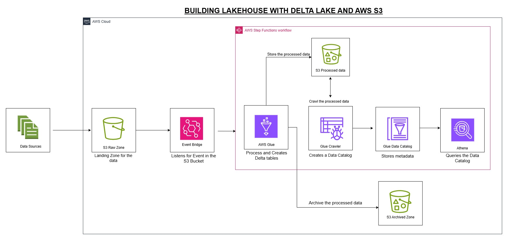

## Lakehouse Architecture for E-Commerce Transactions 
This project implements a Lakehouse architecture for e-commerce transactions using Apache Spark and Delta Lake. The architecture is designed to handle large volumes of data efficiently and provide real-time analytics capabilities.

    

## Setup Instructions
create an s3 bucket for the project
`aws s3 mb s3://lakehouse-bucket-125`

move data into the s3 bucket
`aws s3 cp ./Data/ s3://lakehouse-bucket-125/land-folder/Data/ --recursive`

set timeout and performance on lambda 
`aws lambda update-function-configuration --function-name lakehouse-lambda --timeout 900 --memory-size 10240`
