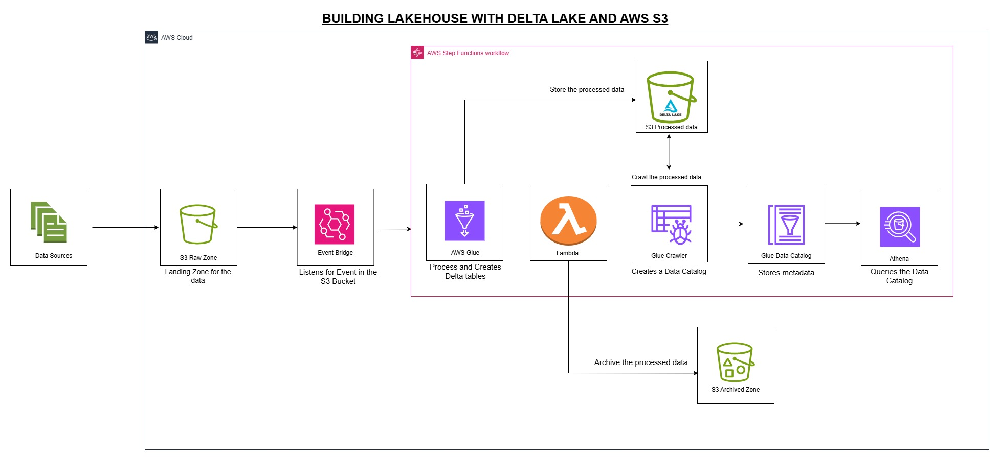

# Lakehouse Architecture for E-Commerce Transactions on AWS

## Project Overview

This project implements a production-grade Lakehouse architecture on AWS designed to process e-commerce transactional data. It ingests raw CSV data from Amazon S3, processes it using AWS Glue with Spark and Delta Lake for reliability and ACID compliance, orchestrates the workflow using AWS Step Functions, and makes the curated data available for analytics via Amazon Athena. The entire process emphasizes high data reliability, schema enforcement, data freshness, and is automated using CI/CD pipelines via GitHub Actions.

---

## Architecture

The architecture follows a standard Lakehouse pattern with distinct zones in S3:

1.  **Raw Zone (S3):** Landing area for incoming raw CSV files (`products`, `orders`, `order_items`).
2.  **Processing Layer (AWS Glue + Spark + Delta Lake):**
    * AWS Glue jobs run Spark code.
    * Spark reads raw data, performs cleaning, validation (null checks, referential integrity, deduplication), and type casting.
    * Data is written into Delta Lake tables, ensuring ACID transactions, schema enforcement, and time travel capabilities.
3.  **Processed Zone (S3):** Stores the cleaned, deduplicated, and optimized data in Delta Lake format. This zone is structured for efficient querying.
4.  **Metadata Layer (AWS Glue Data Catalog):** Stores metadata (schema, partitions) about the Delta tables, enabling seamless querying by Athena and interoperability with Glue jobs.
5.  **Query Layer (Amazon Athena):** Provides a serverless SQL interface for analysts to query the processed Delta tables directly from S3.
6.  **Orchestration (AWS Step Functions):** Manages the end-to-end ETL lifecycle, including job execution, error handling, archiving, and notifications.
7.  **Automation (GitHub Actions):** Provides CI/CD for the Spark ETL scripts and potentially the Step Functions definition.
8.  **Archival Zone (S3):** Stores the original raw files after they have been successfully processed.

<p align="center">
    
</p>

*Textual Flow:*
`Raw CSV Files (S3 Raw Zone)` -> `AWS Glue Job (Spark + Delta Lake)` -> `Delta Tables (S3 Processed Zone)` -> `AWS Glue Data Catalog Update` -> `Amazon Athena Querying`

*Orchestration:* `EventBridge` -> `AWS Step Functions` -> `(Glue, Lambda, Crawler, Athena, SNS)`

*Archiving:* `Raw CSV Files (S3 Raw Zone)` -> `Archive Process (Lambda via Step Functions)` -> `Archived Files (S3 Archive Zone)`

*Notifications:* `SNS` -> `(Success/Failure Alerts)`

*CI/CD:* `GitHub Actions` -> `(Code Quality, Testing, Deployment)`

---

## Features

* **Automated Ingestion:** Detects or is triggered by new data arrivals in the S3 raw zone.
* **Data Cleaning & Transformation:** Robust ETL logic using Spark within AWS Glue.
* **Deduplication:** Ensures records are unique within the Delta tables using merge/upsert logic.
* **Schema Enforcement:** Delta Lake enforces schema on write, preventing data corruption.
* **ACID Transactions:** Guarantees atomicity, consistency, isolation, and durability for data operations.
* **Data Partitioning:** Delta tables are partitioned (e.g., by date) for improved query performance in Athena.
* **Metadata Management:** Glue Data Catalog is kept in sync with the Delta tables.
* **Serverless Querying:** Downstream analytics via Amazon Athena using standard SQL.
* **Workflow Orchestration:** AWS Step Functions manage the ETL pipeline state, retries, error handling, and dependencies.
* **CI/CD Automation:** GitHub Actions automate testing and deployment for ETL code and infrastructure.
* **Data Validation:** Implements rules to ensure data quality and integrity.
* **Error Handling & Notifications:** Failed steps trigger alerts via AWS SNS.
* **Archiving:** Processed raw files are automatically archived.

## Technology Stack

* **Storage:** Amazon S3 (Raw, Processed/Lakehouse, Archive zones)
* **ETL:** AWS Glue, Apache Spark
* **Table Format:** Delta Lake
* **Metadata:** AWS Glue Data Catalog
* **Query Engine:** Amazon Athena
* **Orchestration:** AWS Step Functions
* **Helper Functions:** AWS Lambda (for S3 object manipulation/archiving)
* **Notifications:** AWS Simple Notification Service (SNS)
* **CI/CD:** GitHub Actions

---

## Data Sources & Schema

The pipeline processes three core datasets provided as CSV files:

| Dataset | Field | Type | Description |
|---------|--------|------|-------------|
| **Product Data** | product_id | STRING | Primary Identifier |
| | department_id | STRING | |
| | department | STRING | |
| | product_name | STRING | |
| **Orders** | order_num | STRING | |
| | order_id | STRING | Primary Identifier |
| | user_id | STRING | |
| | order_timestamp | TIMESTAMP | |
| | total_amount | DOUBLE | |
| | date | DATE | Potential Partition Key |
| **Order Items** | id | STRING | Primary Identifier for the item line |
| | order_id | STRING | Foreign Key to Orders |
| | user_id | STRING | |
| | days_since_prior_order | INTEGER | |
| | product_id | STRING | Foreign Key to Product Data |
| | add_to_cart_order | INTEGER | |
| | reordered | BOOLEAN | |
| | order_timestamp | TIMESTAMP | |
| | date | DATE | Potential Partition Key |

---

## ETL Pipeline Steps

1.  **Trigger:** The process is initiated (e.g., manually, scheduled, or via an S3 event trigger - *Note: The provided Step Function simulates the trigger*).
2.  **Data Processing (Glue Job):**
    * The main Glue job (`Lakehouse`) is triggered by Step Functions.
    * It reads the corresponding raw CSV files (Products, Orders, Order Items) from the S3 raw zone.
    * Applies cleaning logic (handling nulls, standardizing formats).
    * Performs validation checks (see Validation Rules below). Logs rejected records.
    * Applies schema and casts data types.
    * Uses Delta Lake's `MERGE` operation to insert new records and update existing ones (based on primary identifiers) in the target Delta tables located in the S3 processed zone . This handles deduplication.
    * Writes data partitioned by a suitable key (e.g., `date`) for performance.
3.  **Archiving (Lambda Function):**
    * Upon successful completion of the Glue job, Step Functions invoke a Lambda function (`Moves3Objects`).
    * This function moves the processed source CSV files from the raw zone (`land-folder/Data/`) to an archive prefix (`processed_folder/output/` - *Note: This seems like an unusual naming convention for an archive, consider renaming to `/archived/`*).
    * The Step Function handles potential pagination if many files need archiving.
4.  **Metadata Update (Glue Crawler):**
    * After successful archiving, Step Functions trigger a Glue Crawler (`delta-crawler`).
    * The crawler scans the Delta tables in the processed zone (`lakehouse-dwh`) and updates the corresponding tables in the Glue Data Catalog (`delta-lakehouse` database). This ensures Athena has the latest schema and partition information.
5.  **Validation (Athena Queries - Optional):**
    * Step Functions run parallel Athena queries against the newly updated tables (`clean_orders`, `clean_orders_items`, `clean_products`) as a final validation check.
6.  **Notifications (SNS):**
    * Step Functions publish messages to an SNS topic indicating success or detailing failures at various stages (Glue Job, Archiving, Crawler, Validation).

---

## Orchestration - AWS Step Functions

The ETL workflow is orchestrated by an AWS Step Functions state machine.

**(See `stepfunctions/delta-lake.json` for the full definition)**
<p align="center">
    
</p>

**Key States & Logic:**

* `RunGlueJob`: Starts the main Glue ETL job (`Lakehouse`) synchronously.
* `CheckGlueJobStatus`: Checks if the Glue job succeeded. Branches to failure handling if not.
* `InitiateArchiveProcess` / `ArchiveProcessedFiles` / `CheckArchiveCompletion` / `ContinueArchiveOperation`: Manages invoking the Lambda function to archive source files, handling potential retries and pagination.
* `RunGlueCrawler` / `WaitForCrawlerToFinish` / `CheckCrawlerStatus`: Starts the Glue Crawler (`delta-crawler`), waits, and checks its status, including retries if the crawler is still running.
* `Parallel Athena Queries`: Executes multiple Athena queries concurrently for basic data validation on the final tables.
* `HandleValidationSuccess`: Publishes a success message to SNS.
* `HandleGlueJobFailure`, `HandleArchiveFailure`, `HandleCrawlerFailure`, `HandleValidationFailure`: Catch errors from specific steps and publish failure notifications to SNS.

## Step Function Execution

The step function workflow executes each task sequentially, ensuring end-to-end ETL processing. Below is an example of a successful execution:

| Step | Status | Duration |
|------|--------|----------|
| RunGlueJob | ✅ Succeeded | 180s |
| CheckGlueJobStatus | ✅ Succeeded | 5s |
| InitiateArchiveProcess | ✅ Succeeded | 10s |
| ArchiveProcessedFiles | ✅ Succeeded | 45s |
| CheckArchiveCompletion | ✅ Succeeded | 15s |
| RunGlueCrawler | ✅ Succeeded | 60s |
| WaitForCrawlerToFinish | ✅ Succeeded | 120s |
| CheckCrawlerStatus | ✅ Succeeded | 5s |
| Parallel Athena Queries | ✅ Succeeded | 60s |
| HandleValidationSuccess | ✅ Succeeded | 2s |

Total execution time: ~15 minutes

The workflow maintains idempotency and ensures all resources are properly cleaned up, even in failure scenarios.
<p align="center">
    
</p>

---

## Validation Rules

The ETL process incorporates the following validation rules:

* **Non-Null Primary Identifiers:** Ensure `product_id`, `order_id`, and `id` (in order_items) are not null.
* **Valid Timestamps:** Check if timestamp fields conform to expected formats.
* **Referential Integrity (Conceptual):** While not strictly enforced by Delta Lake constraints in this setup, logic can be added in Spark to check if `product_id` in `order_items` exists in `products`, and `order_id` in `order_items` exists in `orders`. Rows failing these checks might be flagged or moved to a rejected records location.
* **Deduplication:** Handled via `MERGE` operations based on primary keys when writing to Delta tables.
* **Logging:** Records failing validation are logged (e.g., written to a separate 'rejected' S3 path or logged via CloudWatch).

--- 

## CI/CD - GitHub Actions

Automation is implemented using GitHub Actions, triggered on pushes or merges to the `main` branch. Expected workflows include:

* **Code Quality Checks:** Linting and static analysis of Spark (Python/Scala) code.
* **Unit Tests:** Testing individual functions or components of the Spark ETL logic.
* **Glue Job Deployment:** Packaging and deploying the Spark script to AWS Glue.

---

## Setup and Deployment

1.  **Prerequisites:**
    * AWS Account
    * Configured AWS CLI/SDK with appropriate permissions.
    * GitHub Account/Repository.
    * (Recommended) Infrastructure as Code tool like AWS CDK, CloudFormation, or Terraform.
2.  **Deploy AWS Resources:**
    * Create S3 buckets: raw zone, processed zone, archive zone, Athena results location.
    * Create the Glue Job (`Lakehouse`) with the Spark ETL script.
    * Create the Glue Crawler (`delta-crawler`) pointing to the processed S3 zone.
    * Create the Glue Data Catalog Database (`delta-lakehouse`).
    * Deploy the Lambda function (`Moves3Objects`) for archiving.
    * Create the SNS topic (`etl`) for notifications and subscribe endpoints (e.g., email).
    * Deploy the Step Functions state machine using the provided JSON definition.
    * Configure necessary IAM Roles and Policies for Glue, Step Functions, Lambda, S3 access, etc.
3.  **Configure GitHub Actions:**
    * Add AWS credentials (`AWS_ACCESS_KEY_ID`, `AWS_SECRET_ACCESS_KEY`, `AWS_REGION`) as secrets in the GitHub repository settings.
    * Define workflow files (`.github/workflows/`) for CI/CD steps.
4.  **Code:**
    * Spark ETL scripts : `src/glue_etl.py`.
    * Step Functions JSON : `stepfunctions/delta-lake.json`
    * Lambda function code : `stepfunctions/lambda_function.py` 

---

## How to Run
1.  **Upload Data:** Place raw CSV files (`products.csv`, `orders.csv`, `order_items.csv`) into the configured S3 raw zone path (e.g., `s3://[Your-Bucket-Name]/land-folder/Data/`).
2.  **Configure EventBridge Rule:** 
    * Create an EventBridge rule that watches for `PutObject` events in the S3 raw zone
    * Set the target as the Step Functions state machine
    * The rule will automatically trigger the Step Function when new files arrive
3.  **Monitor Execution:** Observe the execution progress in the AWS Step Functions console.
4.  **Check Notifications:** Monitor the subscribed SNS endpoint for success or failure messages.
5.  **Query Data:** Once the pipeline succeeds, query the `clean_products`, `clean_orders`, and `clean_orders_items` tables in the `delta-lakehouse` database using Amazon Athena.

---

## ACID-Compliant SQL Query Example
<p align="center">
    
</p>


Below is an example of an ACID-compliant INSERT operation using Athena against our Delta Lake table:

```sql
INSERT INTO clean_orders
SELECT *
FROM (
    SELECT *
    FROM (
        VALUES 
            (1, 57, 10504, CAST('2025-04-02 18:08:00.000' AS timestamp(3)), 400.25, '2025-04-02'),
            (2, 24, 12523, CAST('2025-04-06 04:17:00.000' AS timestamp(3)), 373.73, '2025-04-06'),
            (3, 66, 12525, CAST('2025-04-06 13:06:00.000' AS timestamp(3)), 258.10, '2025-04-06')
    ) AS t(order_num, order_id, user_id, order_timestamp, total_amount, date)
) AS new_rows
WHERE NOT EXISTS (
    SELECT 1
    FROM clean_orders existing
    WHERE existing.order_num = new_rows.order_num
        AND existing.order_id = new_rows.order_id
);
```

This query ensures ACID compliance through:

1. **Atomicity**: The INSERT operation either completely succeeds or fails
2. **Consistency**: The WHERE NOT EXISTS clause prevents duplicate entries
3. **Isolation**: Delta Lake's versioning ensures concurrent operations don't interfere
4. **Durability**: Successfully inserted data is permanently stored in the Delta table

The query validates data integrity by checking for existing records before insertion, maintaining transaction safety.